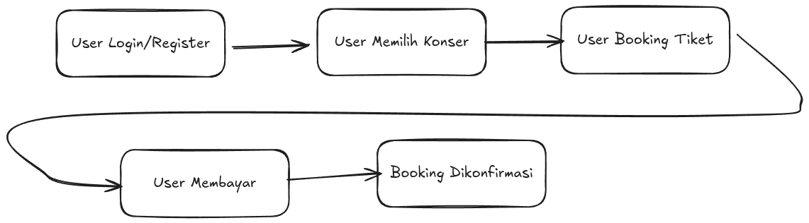
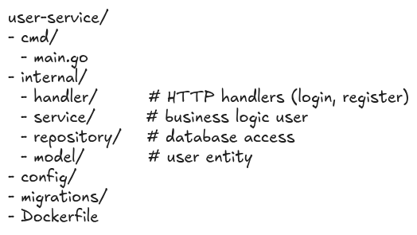
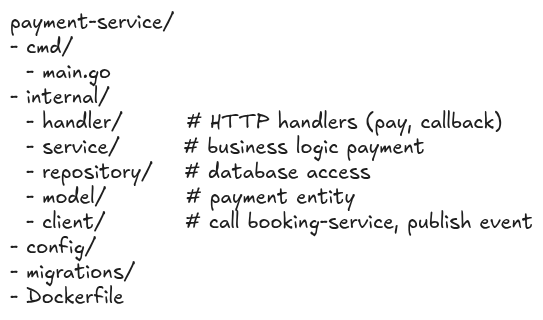

# Bussiness Logic

Dalam sistem ini, dapat kita gambarkan alur sistemnya sebagai berikut:

# Pembagian Service

Dari alur tersebut, dapat kita bagi kedalam 3 services sebagai berikut:

1. User Service
   - Registrasi User
   - Login/Autentikasi User
   - Manajemen profil User
2. Booking Service
   - Membuat booking tiket
   - Menyimpan status booking (PENDING, PAID, CANCELLED)
   - Manajemen stok tiket
3. Payment Service
   - Memproses pembayaran
   - Integrasi dengan Payment Gateway
   - Manajemen history pembayaran

# Interservice Communication

1. Booking Service -> User Service
   - Validasi user sudah login
   - Mengambil user_id untuk melakukan booking tiket
   - Menggunakan REST API (synchronous)
2. Booking Service -> Payment Service
   - Mengirimkan data booking yang harus dibayar (PENDING)
   - Menggunakan REST API (synchronous)
3. Payment Service -> Booking Service
   - Mengirimkan notifikasi ke Booking Service (payment_success, payment_failed)
   - Dapat menggunakan REST API via Webhook, atau Event via Message Broker (asynchronous)

# Folder Structure

## User Service

## Booking Service

## Payment Service

# ERD

